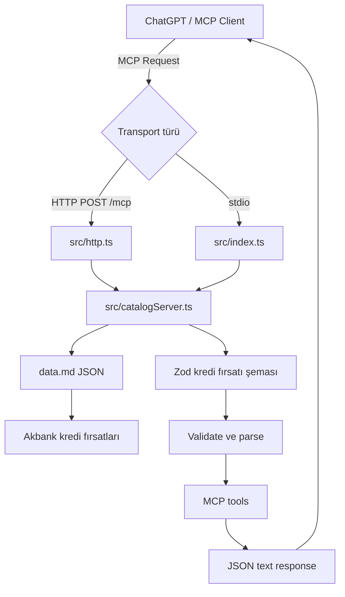
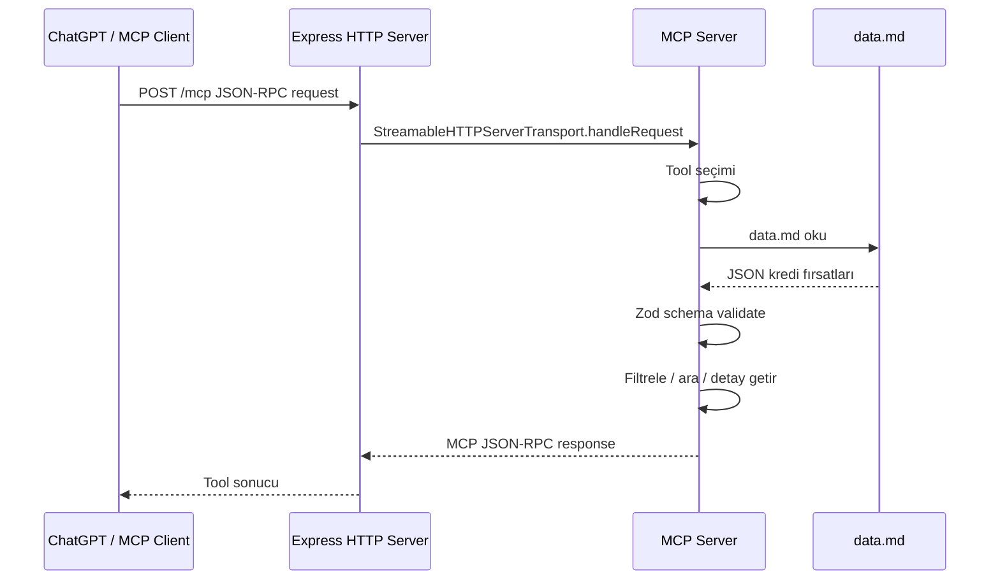
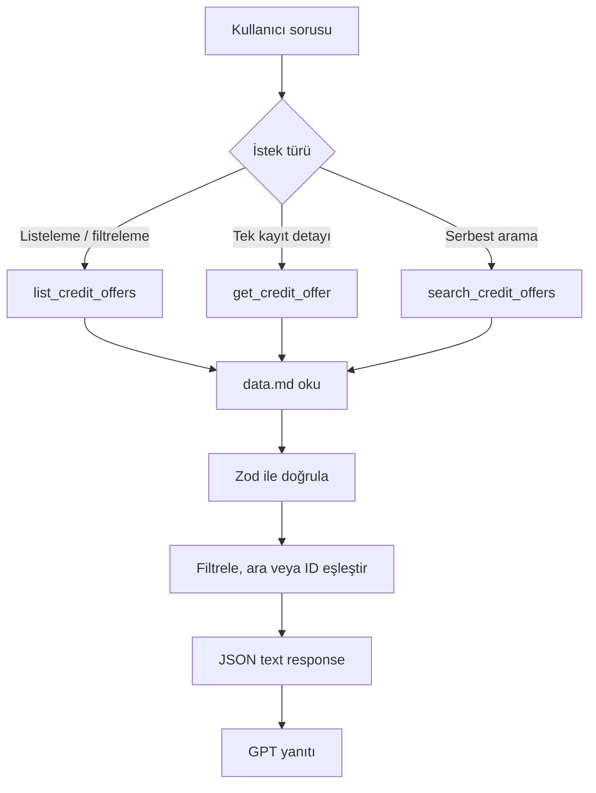
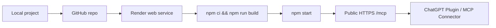

# Akbank Kredi Fırsatları MCP Dokümantasyonu

## Özet

Bu proje, Akbank kredi fırsatlarını Model Context Protocol (MCP) üzerinden GPT ve MCP uyumlu istemcilere sunan bir TypeScript sunucusudur. Veri kaynağı olarak `data.md` dosyası kullanılır. Dosya uzantısı Markdown olsa da içerik JSON formatındadır.

Sunucu iki farklı çalışma biçimini destekler:

- Stdio MCP: Yerel MCP istemcileri ve VS Code MCP kullanımı için.
- HTTP MCP: Render, Docker veya benzeri hosting ortamlarında public HTTPS endpoint açmak için.

## Teknoloji Yığını

- Node.js >= 20
- TypeScript
- Express
- Zod
- `@modelcontextprotocol/sdk`
- MCP Streamable HTTP transport
- MCP stdio transport

## Dosya Yapısı

```text
.
├── data.md
├── src
│   ├── catalogServer.ts
│   ├── http.ts
│   └── index.ts
├── package.json
├── tsconfig.json
├── Dockerfile
├── render.yaml
├── DEPLOY.md
├── README.md
├── plugin-aciklama.md
└── PROJE_DOKUMANI.md
```

## Mimari



## Bileşenler

### `data.md`

Akbank kredi fırsatlarını JSON array olarak tutar. Uygulama her tool çağrısında bu dosyayı okur, JSON olarak parse eder ve Zod şemasıyla doğrular.

### `src/catalogServer.ts`

MCP sunucusunun asıl iş mantığı burada bulunur.

Görevleri:

- Kredi fırsatı veri şemasını tanımlamak.
- `data.md` dosyasını okumak.
- Veriyi Zod ile doğrulamak.
- MCP tool ve resource kayıtlarını yapmak.
- Arama, filtreleme, sıralama ve detay getirme işlemlerini yürütmek.

### `src/index.ts`

Stdio transport kullanan yerel MCP giriş noktasıdır. VS Code MCP gibi yerel istemciler için kullanılır.

### `src/http.ts`

Express tabanlı HTTP MCP giriş noktasıdır. Hosted kullanım için `/mcp` endpoint'ini açar. Ayrıca `/health` endpoint'i ile servis sağlık kontrolü sağlar.

### `Dockerfile`

Projeyi container olarak build edip çalıştırmak için kullanılır. Build aşamasında TypeScript derlemesi yapılır, runtime aşamasında production bağımlılıklarıyla HTTP MCP sunucusu başlatılır.

### `render.yaml`

Render üzerinde web service deploy ayarlarını tanımlar.

## Veri Modeli

`data.md` içindeki her kredi fırsatı aşağıdaki alanları içerir:

| Alan | Tip | Açıklama |
| --- | --- | --- |
| `id` | string | Kredi fırsatının benzersiz kimliği. |
| `bank` | string | Banka adı. |
| `title` | string | Kredi fırsatının görünen adı. |
| `loanType` | string | Kredi türü. Örnek: `İhtiyaç Kredisi`. |
| `minAmount` | number/null | Minimum kredi tutarı. Bilinmiyorsa `null`. |
| `maxAmount` | number/null | Maksimum kredi tutarı. Bilinmiyorsa `null`. |
| `minTermMonths` | number/null | Minimum vade ayı. |
| `maxTermMonths` | number/null | Maksimum vade ayı. |
| `interestRate` | number/null | Faiz oranı. Güncel veri yoksa `null`. |
| `annualCostRate` | number/null | Yıllık maliyet oranı. Güncel veri yoksa `null`. |
| `fees` | string[] | Masraf veya ücret açıklamaları. |
| `requirements` | string[] | Başvuru şartları ve değerlendirme notları. |
| `applicationChannels` | string[] | Başvuru kanalları. |
| `validUntil` | string/null | Kampanya geçerlilik tarihi. |
| `url` | string | Resmi bilgi veya başvuru bağlantısı. |
| `notes` | string | Ek açıklamalar. |

Örnek kayıt:

```json
{
  "id": "AKB-KRD-001",
  "bank": "Akbank",
  "title": "Akbank İhtiyaç Kredisi",
  "loanType": "İhtiyaç Kredisi",
  "minAmount": 10000,
  "maxAmount": 250000,
  "minTermMonths": 3,
  "maxTermMonths": 36,
  "interestRate": null,
  "annualCostRate": null,
  "fees": [],
  "requirements": [
    "Kredi başvurusunun Akbank tarafından değerlendirilip onaylanması gerekir."
  ],
  "applicationChannels": [
    "Akbank Mobil",
    "Akbank İnternet",
    "Akbank şubeleri"
  ],
  "validUntil": null,
  "url": "https://www.akbank.com",
  "notes": "Güncel oranlar Akbank kanallarından kontrol edilmelidir."
}
```

## MCP Tool'ları

### `list_credit_offers`

Akbank kredi fırsatlarını listeler. İsteğe bağlı filtreleme ve sıralama destekler.

Parametreler:

| Parametre | Tip | Açıklama |
| --- | --- | --- |
| `loanType` | string | Kredi tipine göre filtreler. |
| `minAmount` | number | İstenen minimum tutarı karşılayabilecek teklifleri getirir. |
| `maxAmount` | number | İstenen maksimum tutar aralığına uygun teklifleri getirir. |
| `minTermMonths` | number | İstenen minimum vadeyi karşılayabilecek teklifleri getirir. |
| `maxTermMonths` | number | İstenen maksimum vade aralığına uygun teklifleri getirir. |
| `channel` | string | Başvuru kanalına göre filtreler. |
| `sortBy` | enum | `title`, `loanType`, `maxAmount`, `maxTermMonths` alanlarından biriyle sıralar. |

Örnek sorular:

```text
İhtiyaç kredisi fırsatlarını listele.
Akbank Mobil üzerinden başvurulabilen kredileri göster.
36 ay vadeye uygun kredi fırsatlarını getir.
```

### `get_credit_offer`

Tek bir kredi fırsatını ID ile getirir.

Parametreler:

| Parametre | Tip | Açıklama |
| --- | --- | --- |
| `id` | string | Kredi fırsatı kimliği. Örnek: `AKB-KRD-001`. |

Örnek soru:

```text
AKB-KRD-001 kodlu kredi fırsatının detaylarını getir.
```

### `search_credit_offers`

Kredi fırsatlarında serbest metin araması yapar.

Aranan alanlar:

- `id`
- `bank`
- `title`
- `loanType`
- `notes`
- `url`
- `fees`
- `requirements`
- `applicationChannels`

Örnek sorular:

```text
Konut kredisi ara.
Mobil başvuru yapılabilen kredileri bul.
Taşıt kredisi fırsatlarını göster.
```

## MCP Resource

Sunucu aşağıdaki resource'u da yayınlar:

```text
credit-offers://all
```

Bu resource, `data.md` içindeki tüm Akbank kredi fırsatlarını JSON olarak döndürür.

## Request Akışı



## Tool Karar Akışı



## HTTP Endpoint'leri

### `GET /health`

Sunucunun ayakta olup olmadığını kontrol eder.

Örnek yanıt:

```json
{
  "ok": true,
  "name": "akbank-credit-offers-mcp"
}
```

### `POST /mcp`

MCP Streamable HTTP endpoint'idir. ChatGPT veya MCP uyumlu istemciler bu endpoint'e bağlanır.

Deploy sonrası örnek URL:

```text
https://your-render-service.onrender.com/mcp
```

## Lokal Çalıştırma

Bağımlılıkları kur:

```bash
npm install
```

Projeyi derle:

```bash
npm run build
```

Stdio MCP sunucusunu geliştirme modunda çalıştır:

```bash
npm run dev
```

HTTP MCP sunucusunu production modunda çalıştır:

```bash
npm start
```

Varsayılan port:

```text
3000
```

Port ortam değişkeniyle değiştirilebilir:

```bash
PORT=3001 npm start
```

## Deploy Akışı



## Render Ayarları

Render üzerinde web service oluştururken önerilen ayarlar:

```text
Language: Node
Build Command: npm ci && npm run build
Start Command: npm start
Health Check Path: /health
```

Deploy tamamlandıktan sonra MCP URL formatı:

```text
https://RENDER-SERVICE-ADIN.onrender.com/mcp
```

## Docker Kullanımı

Image build et:

```bash
docker build -t akbank-credit-offers-mcp .
```

Container çalıştır:

```bash
docker run --rm -p 3000:3000 akbank-credit-offers-mcp
```

Lokal MCP URL:

```text
http://localhost:3000/mcp
```

## ChatGPT Plugin / MCP Bağlantısı

ChatGPT tarafında MCP sunucusu eklerken public HTTPS endpoint kullanılmalıdır:

```text
https://DEPLOY-URL/mcp
```

Açıklama alanı için `plugin-aciklama.md` içindeki "Form için önerilen açıklama" metni kullanılabilir.

Kimlik doğrulama zorunlu değilse `No authentication` seçilmelidir. Kullanılan arayüz sadece OAuth kabul ediyorsa bu sunucuya ayrıca OAuth katmanı eklenmelidir.

## Güvenlik ve Veri Notları

Faiz oranı, yıllık maliyet oranı, masraf ve kampanya geçerlilik tarihi gibi finansal alanlar güncel kaynak olmadan doldurulmamalıdır. Bu nedenle mevcut örnek veride bazı alanlar `null` bırakılmıştır.

GPT yanıtlarında güncel faiz, masraf ve kampanya koşulları için Akbank resmi kanallarının kontrol edilmesi gerektiği belirtilmelidir.

## Test Soruları

GPT plugin içinde aşağıdaki sorularla test yapılabilir:

```text
Akbank kredi fırsatlarını listele.
İhtiyaç kredisi fırsatlarını göster.
Konut kredisi detaylarını getir.
Akbank Mobil üzerinden başvurulabilen krediler hangileri?
AKB-KRD-001 kodlu kredi fırsatının detaylarını göster.
36 ay vadeye uygun kredi fırsatlarını listele.
```

## Doğrulama

Derleme doğrulaması:

```bash
npm run build
```

Stdio MCP smoke test senaryosu:

```text
Tool: search_credit_offers
Query: Konut
Beklenen sonuç: AKB-KRD-003 / Akbank Konut Kredisi
```

HTTP sağlık kontrolü:

```bash
curl http://localhost:3000/health
```

Beklenen yanıt:

```json
{
  "ok": true,
  "name": "akbank-credit-offers-mcp"
}
```

## Gelecek Geliştirmeler

- Gerçek Akbank kampanya oranlarının ve geçerlilik tarihlerinin eklenmesi.
- OAuth veya API key tabanlı erişim kontrolü.
- OpenAPI Actions uyumluluğu için REST wrapper eklenmesi.
- Kredi hesaplama tool'u eklenmesi.
- Veri kaynağının statik JSON yerine harici CMS veya veritabanına taşınması.